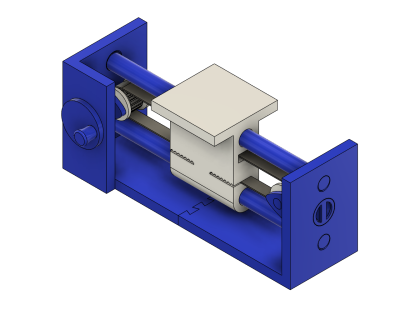
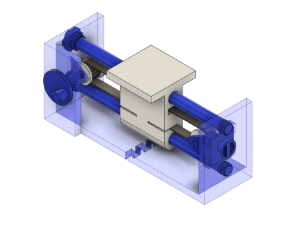

# Belt Demo (04/2020)

<table>
<tr>
<td></td>
<td></td>
</tr>
<tr>
<td></td>
<td></td>
</tr>
</table>

A demonstration of linear motion with a carrier, GT2 timing belt, driving pulley, and an idler pulley. Uses the [parametric GT2 pulley](https://github.com/vsergeev/3d-gears/tree/master/parametric-gt2-pulley) component. Includes a built-in screw tensioner on the idler pulley. GT2 timing belt should be 2mm pitch, 6mm wide, and about 20cm long.

**Design**: [Belt Demo v52.f3d](Belt%20Demo%20v52.f3d) (Fusion 360 Archive)

**Design**: https://a360.co/2UVFbJR (A360)

**STLs**:

  * [Frame Left.stl](stl/Frame%20Left.stl)
  * [Frame Right.stl](stl/Frame%20Right.stl)
  * [Guide Rod.stl](stl/Guide%20Rod.stl)
  * [Idler Frame.stl](stl/Idler%20Frame.stl)
  * [Idler Axle.stl](stl/Idler%20Axle.stl)
  * [Tensioner Screw.stl](stl/Tensioner%20Screw.stl)
  * [Shaft Handle.stl](stl/Shaft%20Handle.stl)
  * [Shaft.stl](stl/Shaft.stl)
  * [GT2 Shaft Pulley.stl](stl/GT2%20Shaft%20Pulley.stl)
  * [GT2 Idler Pulley.stl](stl/GT2%20Idler%20Pulley.stl)
  * [Carrier.stl](stl/Carrier.stl)

**3MFs**:

  * [Blue Pieces.3mf](3mf/Blue%20Pieces.3mf)
  * [White Pieces.3mf](3mf/White%20Pieces.3mf)

**Recommended Print Settings:** 0.20mm layer height, 15% infill, no supports

**Thingiverse:** https://www.thingiverse.com/thing:4304834

**License**: 
