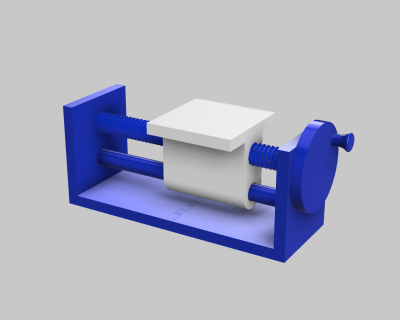

# Lead Screw Demo (09/2018)

<table>
<tr>
<td></td>
<td></td>
</tr>
</table>

A demonstration of a lead screw machine.

**Design**: [Lead Screw Demo v65.f3d](Lead%20Screw%20Demo%20v65.f3d) (Fusion 360 Archive)

**Design**: https://a360.co/2O5kZ2h (A360)

**STLs**:

  * [Carrier.stl](stls/Carrier.stl)
  * [Frame Back.stl](stls/Frame%20Back.stl)
  * [Frame Front.stl](stls/Frame%20Front.stl)
  * [Guide Rod.stl](stls/Guide%20Rod.stl)
  * [Lead Screw Cap.stl](stls/Lead%20Screw%20Cap.stl)
  * [Lead Screw Knob.stl](stls/Lead%20Screw%20Knob.stl)
  * [Lead Screw.stl](stls/Lead%20Screw.stl)

**Recommended Print Settings:** 0.20mm layer height, 20% infill

**Thingiverse:** https://www.thingiverse.com/thing:3336456

**License**: 
