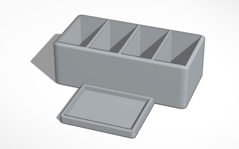
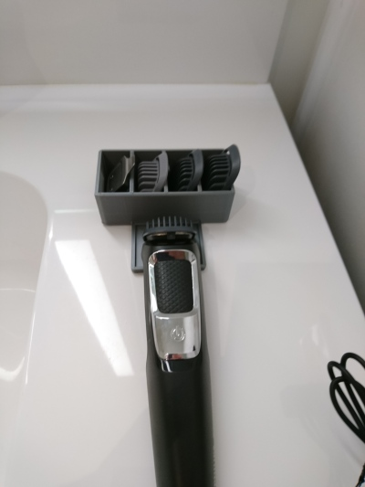

# Trimmer Holder (08/2018)

<table>
<tr>
<td></td>
<td></td>
</tr>
</table>

A simple tray and attachments holder for a beard trimmer.

**Design:** https://www.tinkercad.com/things/lr21kWtdHo0 (Tinkercad)

**STLs:** [trimmer-holder.stl](stls/trimmer-holder.stl)

**Recommended Print Settings:** 0.20mm layer height, 20% infill

**License**: 
