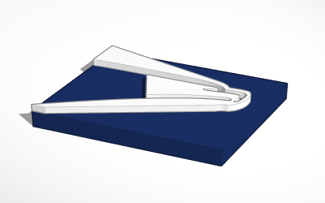
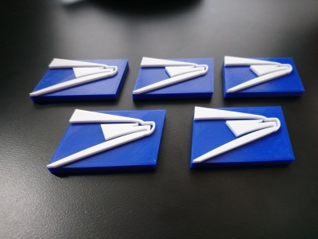

# USPS Fridge Magnet (08/2018)

<table>
<tr>
<td></td>
<td></td>
</tr>
</table>

A USPS logo fridge magnet. Accommodates a 10x2 mm disc magnet. A filament change G-code instruction should be used at the 5mm Z height to transition from blue to white filament.

Inkscape was used to separate the eagle from the background in the original logo into separate SVGs. These SVGs were then imported into Tinkercad to create the model.

**Source SVGs:** [usps-logo-original.svg](usps-logo-original.svg) [usps-logo-bottom.svg](usps-logo-bottom.svg) [usps-logo-top.svg](usps-logo-top.svg)

**Design:** https://www.tinkercad.com/things/3Gt6zLHxfGz (Tinkercad)

**STLs:** [usps-fridge-magnet.stl](stls/usps-fridge-magnet.stl)

**Recommended Print Settings:** 0.20mm layer height, 20% infill, filament change at 5mm Z

**License:** [See USPS for Allowed Uses](https://about.usps.com/doing-business/rights-permissions/common-use-trademarks-copyrights.htm)
